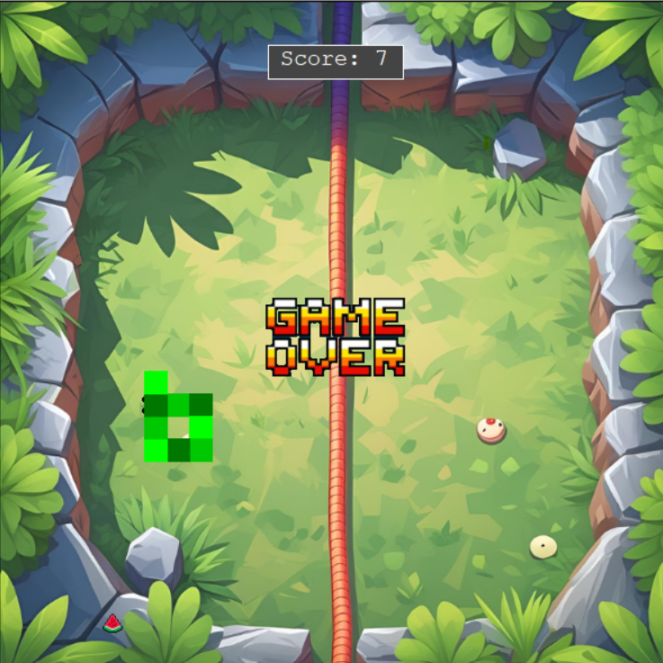

# Snake Game

Classic Snake game built with Python's turtle module. Features multiple fruit types, sound effects, and a dynamic scoreboard.

## How to Play

- Use **W** to move up, **S** to move down, **A** to move left, and **D** to move right.  
- Eat fruits to grow your snake and increase your score.  
- Avoid hitting the walls or your own tail.

## Game Preview




## Requirements

- Python 3.x  
- `playsound` library

Install the required library using:

```bash
pip install playsound
